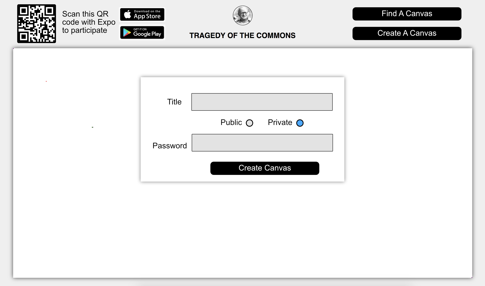
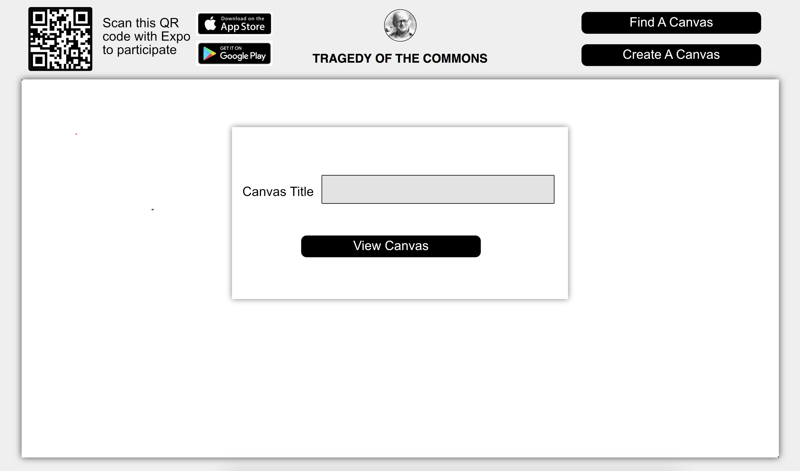

# Tragedy Of The Commons

## Overview

Wouldn't it be great if everyone could draw on a shared pixel based canvas? Probably not.

Tragedy Of The Commons is composed of a web app and a mobile app. On the web side users can view a canvas as it evolves in real-time, as well as create a new canvas that can be either publicly accessible or secured with a private password to share with friends. There is also a default public canvas that anyone can edit. To edit a canvas, that is to change the colors of pixels, you use the mobile app as your controller. The web app is purely for displaying canvases and creating new ones.

The web app will be built as a single page React application.
The mobile app will be built with React Native and served over Expo.
Web and mobile frontends will communicate with the server over WebSockets by way of the socket.io library.

## Data Model

Data is modeled by two schemas: Pixel and Canvas.

An Example Pixel:

```javascript
{
  row: 87,
  col: 133,
  color: '#66ff66'
}
```

An Example Private Canvas with Embedded Pixels:

```javascript
{
  title: 'AIT Private Canvas',
  password: // a password hash,
  rows: 350,
  cols: 700,
  pixels: // an array of Pixels
}
```

An Example Public Canvas with Embedded Pixels:

```javascript
{
  title: 'AIT Public Canvas',
  password: null,
  rows: 350,
  cols: 700,
  pixels: // an array of Pixels
}
```


## [Link to Commented First Draft Schema](/tragedy-of-the-commons/server/db.js)

## Wireframes

The web app is a single page application for viewing, creating, and searching for canvases.






The mobile app is a single screen for editing and searching for canvases.


## Site map

Since the web frontend is a single page any path from root will be treated by the server as if it were root. What canvas a user sees is managed by socket.io namespaces rather than routes. Cookies will also ensure that a user can refresh their page and still view the canvas they were viewing rather than being brought back to the default public canvas.

## User Stories or Use Cases

1. as a user, I can enter the site.
2. as a user, I can create a new canvas.
3. as a user, I can find an existing canvas.
4. as a user, I can watch a canvas change as other people edit it.
5. as a user, I can enter the mobile app.
6. as a user, I can use the mobile app to find a canvas.
7. as a user, I can use the mobile app to edit a canvas.

## Research Topics

* (3 points) Socket.io
    * I will use the server and client Socket.io libraries to handle real-time communication between instances of the app.
* (5 points) React and React Native
    * I will use React and React Native as the web and mobile user interface libraries respectively.

8 points total out of 8 required points

## [Link to Initial Main Project File](/tragedy-of-the-commons/server/index.js)

## Annotations / References Used

1. [Socket.io docs](https://socket.io/docs/)
2. [React.js docs](https://reactjs.org/docs/hello-world.html)
3. [React Native docs](https://facebook.github.io/react-native/docs/getting-started.html)
