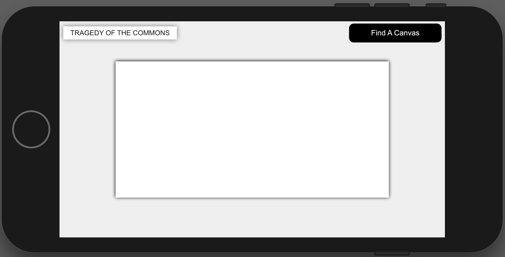

# Tragedy Of The Commons

## Overview

Wouldn't it be great if everyone could draw on a shared pixel based canvas? Probably not.

Tragedy Of The Commons is composed of a web app and a mobile app. On the web side users can view a canvas as it evolves in real-time, as well as create a new canvas that can be either publicly accessible or secured with a private password to share with friends. There is also a default public canvas that anyone can edit. To edit a canvas, that is to change the colors of pixels, you use the mobile app as your controller. The web app is purely for displaying canvases and creating new ones.

The web app will be built as a single page React application.
The mobile app will be built with React Native and served over Expo.
Web and mobile frontends will communicate with the server over WebSockets by way of the socket.io library.

## Data Model

Data is modeled by two schemas: Pixel and Canvas.

An Example Pixel:

```javascript
{
  row: 87,
  col: 133,
  color: '#66ff66'
}
```

An Example Private Canvas with Embedded Pixels:

```javascript
{
  title: 'AIT Private Canvas',
  password: // a password hash,
  rows: 350,
  cols: 700,
  pixels: // an array of Pixels
}
```

An Example Public Canvas with Embedded Pixels:

```javascript
{
  title: 'AIT Public Canvas',
  password: null,
  rows: 350,
  cols: 700,
  pixels: // an array of Pixels
}
```


## [Link to Commented First Draft Schema](/tragedy-of-the-commons/server/db.js)

## Wireframes

The web app is a single page application for viewing, creating, and searching for canvases.


The mobile app is a single screen for editing and searching for canvases.



## Site map

Since the web frontend is a single page any path from root will be treated by the server as if it were root. What canvas a user sees is managed by socket.io namespaces rather than routes. Cookies will also ensure that a user can refresh their page and still view the canvas they were viewing rather than being brought back to the default public canvas.

## User Stories or Use Cases

(___TODO__: write out how your application will be used through [user stories](http://en.wikipedia.org/wiki/User_story#Format) and / or [use cases](https://www.mongodb.com/download-center?jmp=docs&_ga=1.47552679.1838903181.1489282706#previous)_)

1. as non-registered user, I can register a new account with the site
2. as a user, I can log in to the site
3. as a user, I can create a new grocery list
4. as a user, I can view all of the grocery lists I've created in a single list
5. as a user, I can add items to an existing grocery list
6. as a user, I can cross off items in an existing grocery list

## Research Topics

(___TODO__: the research topics that you're planning on working on along with their point values... and the total points of research topics listed_)

* (5 points) Integrate user authentication
    * I'm going to be using passport for user authentication
    * And account has been made for testing; I'll email you the password
    * see <code>cs.nyu.edu/~jversoza/ait-final/register</code> for register page
    * see <code>cs.nyu.edu/~jversoza/ait-final/login</code> for login page
* (4 points) Perform client side form validation using a JavaScript library
    * see <code>cs.nyu.edu/~jversoza/ait-final/my-form</code>
    * if you put in a number that's greater than 5, an error message will appear in the dom
* (5 points) vue.js
    * used vue.js as the frontend framework; it's a challenging library to learn, so I've assigned it 5 points

10 points total out of 8 required points (___TODO__: addtional points will __not__ count for extra credit_)


## [Link to Initial Main Project File](/tragedy-of-the-commons/server/index.js)

## Annotations / References Used

(___TODO__: list any tutorials/references/etc. that you've based your code off of_)

1. [socket.io docs](http://passportjs.org/docs) - (add link to source code that was based on this)
2. [react.js docs](https://vuejs.org/v2/guide/) - (add link to source code that was based on this)
