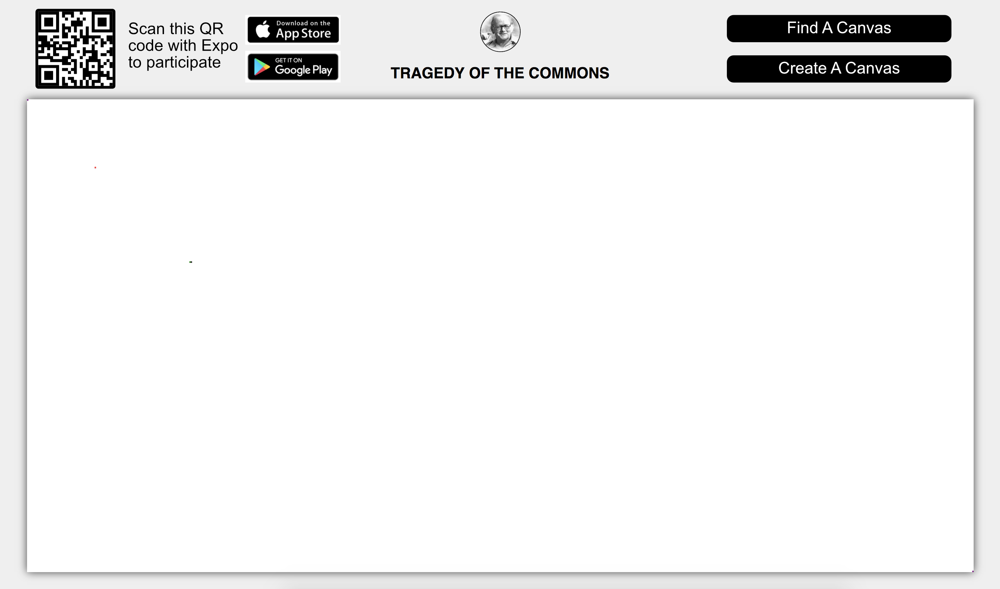

# Tragedy Of The Commons

## Overview

Wouldn't it be great if everyone could draw on a shared pixel based canvas? Probably not.

Tragedy Of The Commons is composed of a web app and a mobile app. On the web side users can view a canvas as it evolves in real-time, as well as create a new canvas that can be either publicly accessible or secured with a private password to share with friends. There is also a default public canvas that anyone can edit. To edit a canvas, that is to change the colors of pixels, you use the mobile app as your controller. The web app is purely for displaying canvases and creating new ones.

The web app will be built as a single page React application.
The mobile app will be built with React Native and deployed over Expo.
Web and mobile frontends will communicate with the server over WebSockets by way of the Socket.io library.

## Data Model

Data stored on the server is modeled by two schemas: Canvas and Password

An Example Password:

```javascript
{
  hash: // a password hash
  salt: // a random string
}
```

An Example Private Canvas with an embedded Password:

```javascript
{
  title: 'AIT Private Canvas',
  password: // a Password
  rows: 350,
  cols: 700,
  pixels: // an array of strings i.e. ['white', 'green']
}
```

An Example Public Canvas:

```javascript
{
  title: 'AIT Public Canvas',
  password: null,
  rows: 350,
  cols: 700,
  pixels: // an array of strings i.e. ['white', 'green']
}
```


## [Link to Commented First Draft Schema](/tragedy-of-the-commons/server/db.js)

## Wireframes

The web app is a single page application for viewing and creating canvases.




The mobile app is a single screen for editing and searching for canvases.


## Site map

Since this is a single page application the site map can be modeled as a single route: '/'. All others routes will redirect to '/'.

## User Stories or Use Cases

1. as a user, I can enter the site.
2. as a user, I can create a new canvas.
3. as a user, I can find an existing canvas.
4. as a user, I can watch a canvas change as other people edit it.
5. as a user, I can enter the mobile app.
6. as a user, I can use the mobile app to find a canvas.
7. as a user, I can use the mobile app to edit a canvas.

## Research Topics

* (3 points) Socket.io
    * I will use the server and client Socket.io libraries to handle real-time communication between instances of the app. This will be used on the web and mobile frontends as well as the server so I give it three points.
* (5 points) React and React Native
    * I will use React and React Native as the web and mobile user interface libraries respectively. Most of the code for this project will come from these libraries so I give it five points.
* (0 points) Create React App
    * I will use Create React App to bootstrap the web application's build configuration with webpack, babel, build optimizations, etcetera. This is essentially no work on my part so I give it zero points.
* (0 points) Expo
    * I will use Expo to bootstrap the mobile application's build configuration and to deploy the finished product. This is essentially no work on my part so I give it zero points.

8 points total out of 8 required points

## [Link to Initial Main Project File](/tragedy-of-the-commons/server/index.js)

## Annotations / References Used

1. [Socket.io docs](https://socket.io/docs/)
2. [React.js docs](https://reactjs.org/docs/hello-world.html)
3. [React Native docs](https://facebook.github.io/react-native/docs/getting-started.html)
4. [Create React App docs](https://github.com/facebookincubator/create-react-app)
5. [Expo docs](https://docs.expo.io/versions/latest/index.html)
